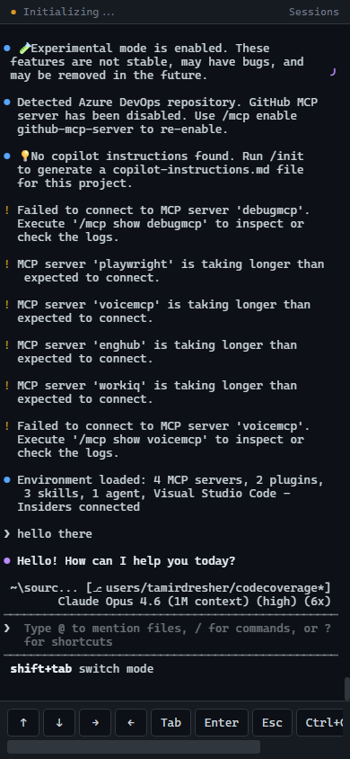
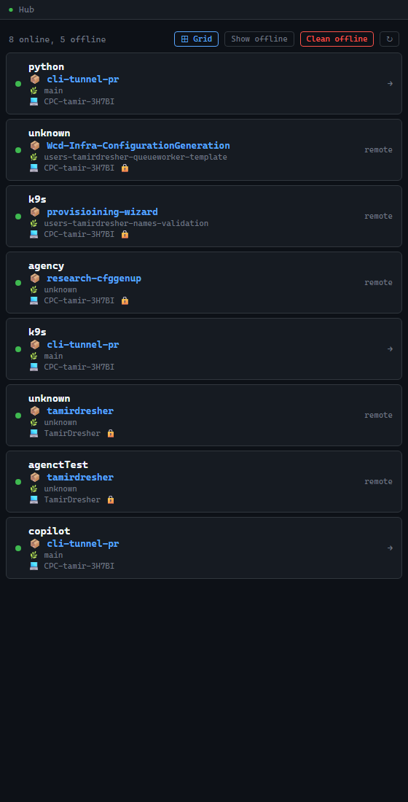
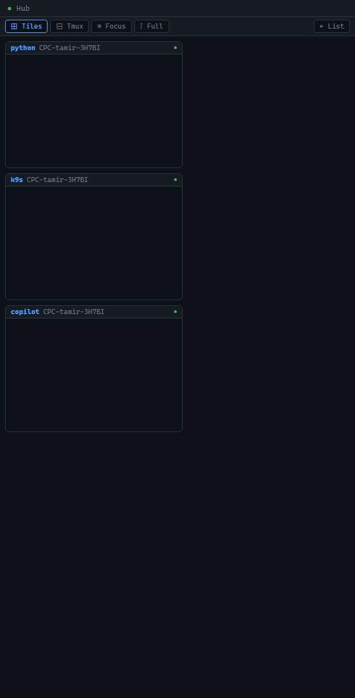
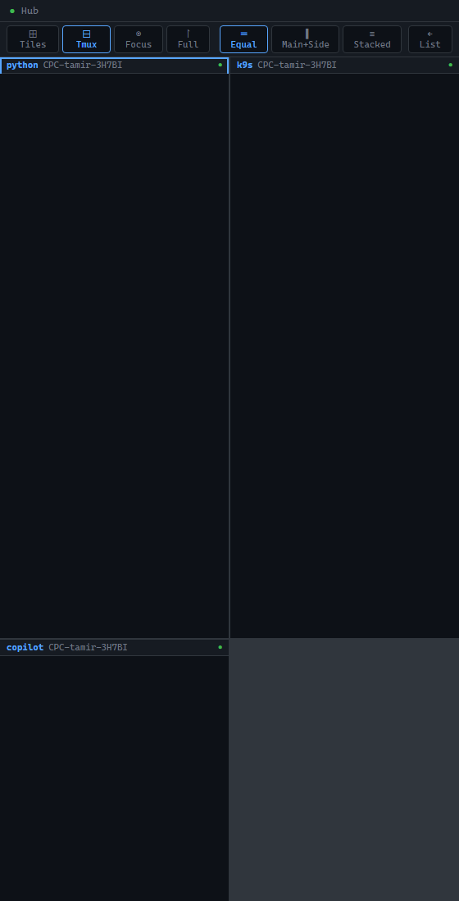
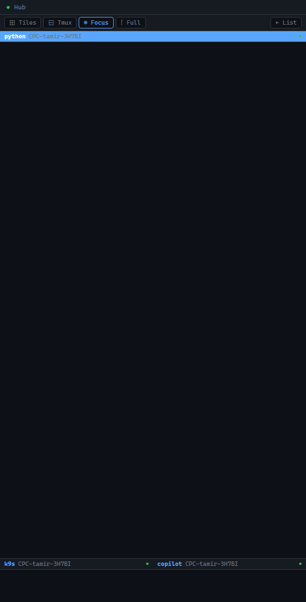
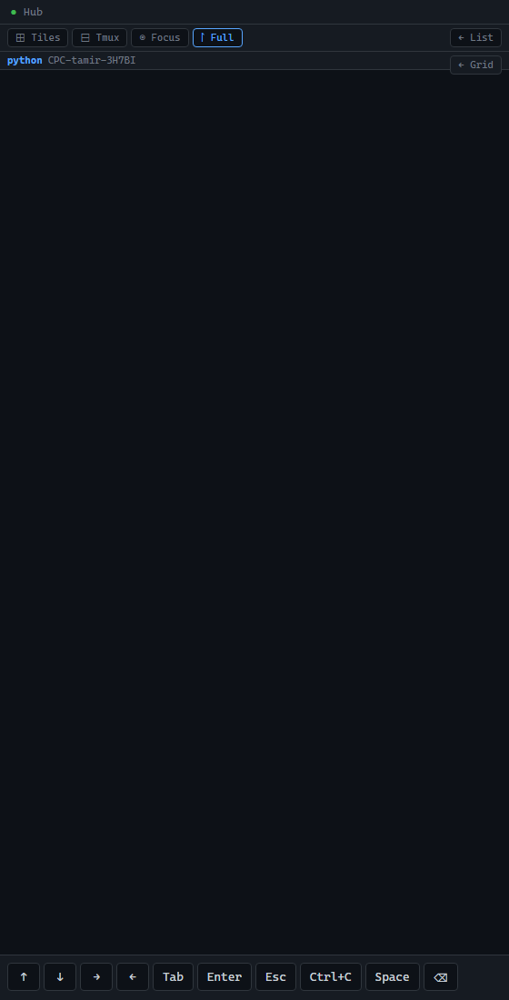

# cli-tunnel

Tunnel any CLI app to your phone — see the exact terminal output in your browser and type back into it.

```bash
npx cli-tunnel copilot --yolo
npx cli-tunnel python -i
npx cli-tunnel k9s
```



## How It Works

1. Your command runs in a **PTY** (pseudo-terminal) — full TUI with colors, diffs, interactive prompts
2. Raw terminal output is streamed over **WebSocket** to **xterm.js** in your browser
3. **Microsoft Dev Tunnels** provide an authenticated HTTPS relay — zero servers to deploy
4. **Bidirectional**: type on your phone → keystrokes go into the CLI session
5. **Private by default**: only your Microsoft/GitHub account can access the tunnel

## Install

```bash
npm install -g cli-tunnel
```

Or use directly with npx (no install needed):

```bash
npx cli-tunnel <command> [args...]
```

If devtunnel isn't installed, cli-tunnel will offer to install it for you automatically.

## Quick Start

```bash
# Run copilot and access it from your phone
cli-tunnel copilot --yolo

# A QR code appears — scan it with your phone
# Press any key to start the CLI tool
# Your phone now shows the exact same terminal!
```

## Usage

Devtunnel is enabled by default. All flags after the command name pass through to the underlying app — cli-tunnel doesn't interpret them.

```bash
# Run copilot with any flags
cli-tunnel copilot --yolo
cli-tunnel copilot --model claude-sonnet-4 --agent squad

# Name your session (shows in the hub dashboard)
cli-tunnel --name wizard copilot --agent squad

# Works with any CLI app
cli-tunnel python -i
cli-tunnel vim myfile.txt
cli-tunnel htop
cli-tunnel k9s
cli-tunnel ssh user@server

# Specific port
cli-tunnel --port 4000 copilot

# Local only (no tunnel, localhost access only)
cli-tunnel --local copilot --yolo
```

**cli-tunnel's own flags** (`--local`, `--port`, `--name`, `--replay`) must come **before** the command.

## Hub Mode — Sessions Dashboard

Run `cli-tunnel` with no command to start **hub mode** — a dashboard that shows all your active sessions across machines.

```bash
cli-tunnel
```



The hub discovers sessions via devtunnel labels. Sessions on the same machine are directly connectable — tap a session card to open it. Remote sessions (other machines) are visible but shown with a 🔒 icon.

## Grid View — Monitor All Sessions

When the hub has 2+ connectable sessions, a **⊞ Grid** button appears. Click it to see all sessions as live terminals — like tmux in your browser.

Four layout modes, switchable without reconnecting:

### ⊞ Tiles — Overview
Scaled-down terminal previews in a card grid, like Windows Task View. Click any tile to go fullscreen.



### ⊟ Tmux — Split Panels
Equal split panels with layout presets: **Equal**, **Main+Side**, and **Stacked**.



### ◉ Focus — Presentation Mode
One terminal takes the full screen. Other sessions shown as clickable strips at the bottom — tap to swap.



### ⊡ Fullscreen
Single terminal with key bar for mobile input. "← Grid" button to go back.



All modes share the same WebSocket connections — switching is instant, no reconnection needed.

## What You See on Your Phone

- **Full terminal** rendered by xterm.js — exact same output as your local terminal
- **Key bar** with ↑ ↓ → ← Tab Enter Esc Ctrl+C for mobile navigation
- **Sessions button** — switch between terminal and sessions dashboard
- **QR code** — scan from your phone to connect instantly

## Prerequisites

- [Node.js](https://nodejs.org/) 22+ (Node 20 works too; Node 23 may need the latest beta)
- [Microsoft Dev Tunnels CLI](https://aka.ms/devtunnels/doc) — cli-tunnel offers to install it if missing
  ```bash
  winget install Microsoft.devtunnel   # Windows
  brew install --cask devtunnel        # macOS
  ```
  Then authenticate once: `devtunnel user login`

## Security

cli-tunnel uses a layered security model:

**Network layer** — Microsoft Dev Tunnels are private by default. Only the Microsoft or GitHub account that created the tunnel can connect. TLS encryption is handled by Microsoft's relay infrastructure. No inbound ports are opened on your machine.

**Session authentication** — Each session generates a unique token (cryptographic random UUID). All HTTP API and WebSocket connections require this token. The token is embedded in the URL you receive at startup.

**Ticket-based WebSocket auth** — The browser exchanges the session token for a single-use, short-lived ticket (60 seconds) to establish the WebSocket connection. This avoids keeping the long-lived token in WebSocket upgrade logs.

**Rate limiting** — Per-IP rate limits on all endpoints (30 requests/minute for HTTP, 10/minute for ticket minting). Returns 429 Too Many Requests when exceeded.

**Input validation** — Only structured JSON messages are accepted over WebSocket. Raw text is rejected and logged. Terminal resize commands are bounds-checked (1–500 cols, 1–200 rows).

**Environment isolation** — The child process receives filtered environment variables. Dangerous variables (NODE_OPTIONS, BASH_ENV, LD_PRELOAD, etc.) and secrets (tokens, keys, passwords) are stripped.

**Audit logging** — All remote keyboard input is logged to `~/.cli-tunnel/audit/` in JSONL format with timestamps and source addresses. Secrets are automatically redacted (OpenAI, GitHub, AWS, JWT, Slack, npm, PEM, Bearer tokens).

**Connection limits** — Maximum 5 concurrent WebSocket connections (2 per IP). Ping/pong heartbeat every 30 seconds cleans stale connections. Sessions expire after 4 hours.

**Security headers** — CSP (no unsafe-inline for scripts), HSTS, X-Frame-Options: DENY, X-Content-Type-Options: nosniff, Referrer-Policy: no-referrer, Cache-Control: no-store.

## Terminal Size Behavior

cli-tunnel uses a single PTY shared between your local terminal and all remote viewers. When a phone connects, the PTY resizes to match the remote device's screen dimensions — the CLI app renders correctly on the device you're actively using.

**Tips for the best experience:**
- Rotate your phone to landscape for a wider terminal
- Use the key bar (↑↓←→ Tab Enter Esc Ctrl+C) at the bottom for navigation
- If multiple devices connect, the last one to resize wins

## FAQ

**Can multiple devices connect to the same session?**
Yes, up to 5 devices simultaneously (2 per IP). All viewers see the same terminal output in real time. Input from any device goes to the same CLI session.

**What happens if my phone disconnects?**
The CLI session keeps running on your machine. When you reconnect, you'll see live output from that point forward. Use `--replay` to enable history replay so reconnecting devices catch up on what they missed.

**Does cli-tunnel work with any CLI app?**
Yes. Any command that runs in a terminal works — copilot, vim, htop, python, ssh, k9s, node, and more. cli-tunnel doesn't interpret the command's output; it streams raw terminal bytes.

**Is there a central server?**
No. cli-tunnel runs entirely on your machine. Microsoft Dev Tunnels provides the relay infrastructure, but no third-party server sees your terminal content.

**What about the anti-phishing page?**
The first time you open a devtunnel URL, Microsoft shows an interstitial warning page. This is a devtunnel security feature. You only see it once per tunnel.

**Does the tool work without devtunnel?**
Yes. Use `--local` to skip tunnel creation. The terminal is available at `http://127.0.0.1:<port>` on localhost only.

**What's hub mode?**
Run `cli-tunnel` with no command to start hub mode — a sessions dashboard that shows all active cli-tunnel sessions. Tap any session to connect, or use Grid view to monitor all sessions simultaneously.

**How does the Grid view connect to sessions?**
The hub reads session tokens from `~/.cli-tunnel/sessions/` (files with owner-only permissions). It proxies ticket requests to each session's local port — no tokens are exposed to the browser client.

## How It's Built

- **[node-pty](https://github.com/microsoft/node-pty)** — spawns the command in a pseudo-terminal
- **[xterm.js](https://xtermjs.org/)** — terminal emulator in the browser (loaded from CDN with SRI hashes)
- **[ws](https://github.com/websockets/ws)** — WebSocket server for real-time streaming
- **[Dev Tunnels](https://learn.microsoft.com/en-us/azure/developer/dev-tunnels/)** — authenticated HTTPS relay

## Blog Post

[Your Copilot CLI on Your Phone — Building Squad Remote Control](https://www.tamirdresher.com/blog/2026/02/26/squad-remote-control)

## License

MIT
